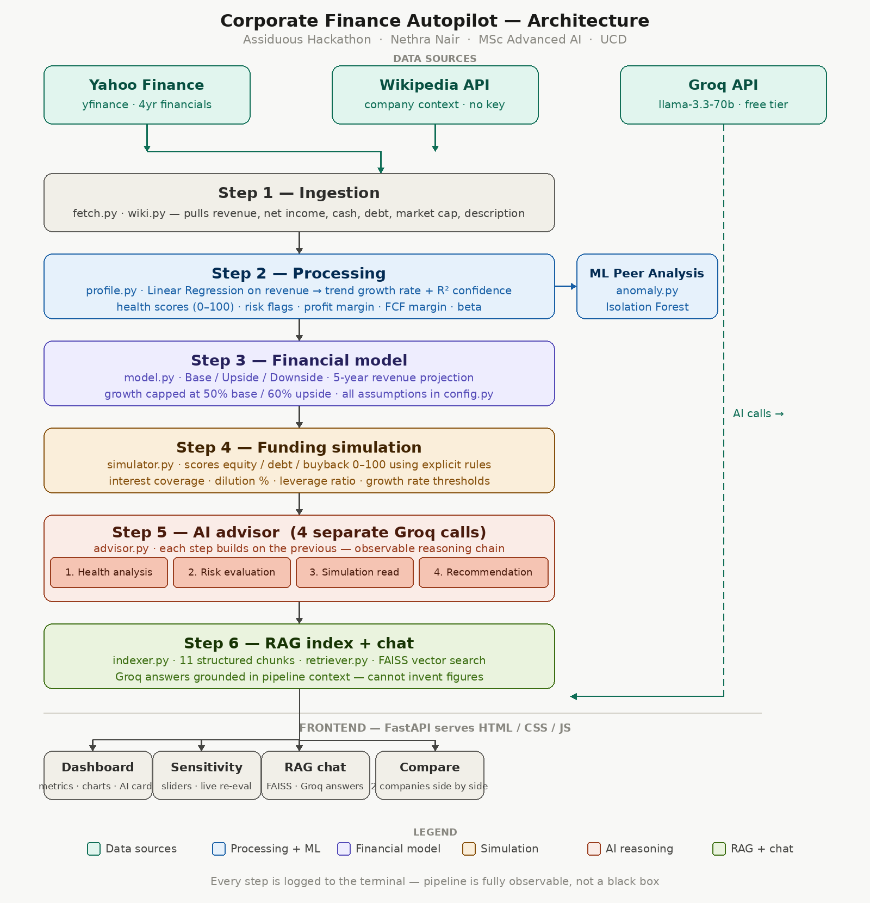

# Corporate Finance Advisor

---

Corporate Finance Advisor is a system that analyses public companies using real financial data. In the system you can pick a company, and it fetches live numbers from Yahoo Finance, builds a three-scenario financial model, runs machine learning peer analysis, simulates funding options, and delivers structured AI advisory, and a chat interface you can question directly.

The core idea is that AI should reason over structured financial outputs, not replace them. Every number comes from a real calculation on real data. The AI reads those numbers and adds qualitative reasoning on top. Every step is logged and visible so you can see exactly how the system arrived at its recommendation.

---

## Live demo

**https://diarchic-alonzo-agriculturally.ngrok-free.dev**

> This link is active while the demo server is running. If it shows a connection error the server is temporarily offline — use the local setup below. When you open the link you will see an ngrok warning page — click **Visit Site** to proceed.

---

## Setup and how to run

### What you need

- Python 3.10+
- A free Groq API key from [console.groq.com](https://console.groq.com)

### Install

```bash
git clone https://github.com/Nethra192002/corporate-advisor.git
cd corporate-advisor
pip install -r requirements.txt
echo "GROQ_API_KEY=your_key_here" > .env
```

### Run locally
```bash
uvicorn main:app --port 8000
```

Open `http://localhost:8000` in your browser. Select a company and click **Run Analysis**. The full pipeline takes around 25–35 seconds to complete.

> **Or use the live demo link above** — the system is already running and accessible without any local setup.

## Architecture



The system runs as a sequential pipeline. Each stage produces structured output that the next stage consumes. Every number comes from real data fetched at runtime.

### How data flows through the system

**Ingestion** is the first step. `fetch.py` pulls four years of annual financial data from Yahoo Finance using the `yfinance` library: revenue, net income, free cash flow, cash, total debt, market cap, beta, and P/E ratio. `wiki.py` fetches a plain-English company description from the Wikipedia REST API. Both are official public APIs.

**Processing** turns raw numbers into meaningful metrics. `profile.py` does two important things here. First, it fits a Linear Regression on the four years of revenue data instead of taking a simple average. A simple average treats 2021 and 2024 as equally important — the regression fits a trend line, so if a company has been accelerating recently that acceleration is captured in the slope. The R² score tells you how reliable this trend is: NVDA scores 0.97 meaning 97% of its revenue variance is explained by the trend, which makes forward projections credible. A volatile company might score 0.4, signalling to treat its projections with more scepticism. Second, it computes health scores across five dimensions — profitability from net margin, growth from the regression slope, stability from beta, leverage from net debt relative to revenue, and an overall weighted score. Risk flags are raised automatically when thresholds are crossed: beta above 1.5 flags high volatility, a negative regression slope flags declining revenue, and so on.

**ML peer analysis** runs alongside processing once two or more companies have been analysed in the session. `anomaly.py` uses Isolation Forest to compare the current company against its peers across six features: profit margin, revenue growth, stability score, leverage score, profitability score, and beta. The reason Isolation Forest was chosen over simpler alternatives like Z-scores or K-Means is that it does not assume the data is normally distributed and it works meaningfully on very small datasets, with only three to five companies in the peer group, K-Means would produce arbitrary clusters and Z-scores would be statistically unreliable. Isolation Forest isolates anomalies by randomly partitioning the feature space: points that are easy to isolate require fewer partitions and are flagged as outliers. This gives a meaningful outlier signal even with a small peer group, and it produces a continuous anomaly score rather than just a binary flag, which is why the dashboard can say "Nvidia's margin is 35.5% above peer average" rather than just "outlier: yes."

**Financial modeling** builds three 5 year projections anchored to the regression growth rate. The base case uses the historical trend. The upside case adds five percentage points, representing favourable execution. The downside case uses half the historical rate, representing deceleration. Growth is capped at 50% for base and 60% for upside, without this cap, a company like Nvidia with 101% historical growth would project to implausible multi trillion revenues by 2030. The cap keeps projections financially credible while still showing the full range. Net income is projected by applying the current margin forward, with a slight improvement assumed for upside and compression for downside. 

**Funding simulation** scores three options: equity raise, debt financing, and share buyback on a 0 to 100 scale using explicit financial rules. The reason this is rule-based rather than a trained model is that there is no labelled training data: we do not have a ground-truth dataset of "company X raised equity and it turned out to be the right call." Without that, a trained model would be fitting noise. Explicit rules are also fully transparent, when Apple scores 100 for debt you can point directly to its 203x interest coverage ratio as the reason, which matters for a financial advisory tool. Equity scores higher when growth is above 10% and dilution would be low. Debt scores higher when interest coverage is strong and the resulting leverage ratio stays manageable. Buyback scores higher when the company is profitable, cash-rich, and growing slowly enough that returning capital makes more sense than deploying it. The highest scorer becomes the recommendation.

**AI advisor** runs four separate Groq API calls in sequence using `llama-3.3-70b-versatile`. Health analysis first, then risk evaluation using the health output as context, then simulation interpretation, then the final recommendation. The reason these are four separate calls rather than one large prompt is that a single prompt asking the model to do everything at once produces generic responses that mix concerns together. Four sequential calls force the model to focus on one thing at a time, with each step building on what came before. All four intermediate outputs are visible in the dashboard so you can inspect the chain of reasoning, not just the conclusion.

**RAG chat** builds a knowledge base of eleven structured text chunks from all pipeline outputs — financials, health scores, projections, simulation scores, and the advisor's four reasoning steps. When a question is asked, FAISS retrieves the three most relevant chunks using TF-IDF vector similarity, then passes them as context to Groq. The model is instructed to only use what the pipeline produced and never invent figures. This means the chat interface is grounded in actual pipeline outputs, not the model's training data.

---

## What the system can do

- **Full financial analysis** of any of the five preset companies — metrics, health scores across five dimensions, risk flags, key ratios, all from real Yahoo Finance data
- **Three-scenario revenue projection**: base, upside, and downside five-year forecasts with net income projections, displayed as interactive Chart.js charts with historical data bridging to projections
- **Sensitivity analysis**: drag sliders to change the growth rate, margin assumption, and upside premium, and the projection chart updates instantly showing the new scenarios
- **AI re-evaluation**: after adjusting sliders, click Re-evaluate and the AI advisor produces a fresh qualitative assessment of what the new assumptions mean for the funding recommendation
- **Funding simulation**: scores equity raise, debt financing, and share buyback with explicit pros and cons for each, a recommended option, and a confidence rating
- **4-step AI advisory**: observable reasoning chain with health analysis, risk evaluation, simulation interpretation, and a structured final recommendation with rationale, conditions, and what to watch
- **ML peer analysis**: Isolation Forest comparison against other analysed companies showing outlier status, peer ranking, and metric-level differences vs peer average
- **RAG chat**: ask anything about the company's financials, risk profile, or funding options and get answers grounded in the pipeline's own outputs
- **Company comparison**: pick any two of the five companies and see health scores, revenue projections, and AI funding recommendations side by side with an AI head-to-head summary
- **Pipeline trace log**: during loading, a live terminal-style log shows every pipeline step as it runs so the system's operation is fully observable

---

## Data sources and libraries declared

| Source | What it provides | How accessed |
|--------|-----------------|--------------|
| Yahoo Finance | Revenue, net income, cash, debt, market cap, beta, P/E — 4 years annual | `yfinance` Python library, public data feed, no key required |
| Wikipedia REST API | Company description and sector overview | Official public API, free for any use |
| Groq API | LLM inference for advisor and chat | Free tier, `llama-3.3-70b-versatile` |

**Libraries:** `fastapi` · `uvicorn` · `yfinance` · `requests` · `groq` · `faiss-cpu` · `scikit-learn` · `numpy` · `sentence-transformers` · `python-dotenv` · `pydantic` · `Chart.js` (CDN, v4.4.1)

---

## Limitations

**Five preset companies only.** The system is configured for AAPL, TSLA, NVDA, SPOT, and MSFT. It cannot accept an arbitrary ticker from the user.

**Four years of data.** Yahoo Finance returns four annual periods. This is enough for trend detection but thinner than a professional model which would typically use ten or more years.

**AI advisor and financial model are not fully connected.** Dragging a sensitivity slider updates the chart but the AI recommendation was generated from the original assumptions. The re-evaluate button approximates a new assessment through the chat endpoint rather than re-running the full pipeline.

**Results lost on server restart.** Everything is stored in memory. Restarting clears all cached analyses and resets the peer comparison pool.

**Funding scores use fixed rules.** The scoring thresholds are grounded in standard corporate finance practice but are not calibrated against real historical funding outcomes.

---

## What I would build with more time

Open the system to any public ticker rather than a preset list. Connect the AI advisor to the financial model properly so changing an assumption re-runs the full pipeline and updates the recommendation. Add SEC EDGAR integration for richer context from 10-K filings. Persist results to a database so analyses survive restarts and historical comparisons become possible. Make the financial model more granular by separating revenue drivers — volume, price, mix — rather than treating revenue as a single compounding line. Add an evaluation layer that checks whether the AI advisor is actually referencing real numbers from the pipeline or drifting into generic statements.

---

*All outputs are for educational purposes only and do not constitute investment advice.*